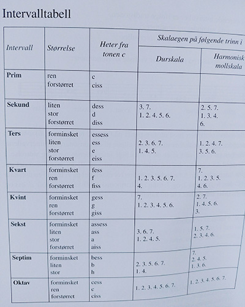

# Om opptaksprøven

<http://www.hf.uio.no/imv/studier/opptak/>

## Første del: Generell musikkteori

### Kvintsirkelen (lagt til av meg)

Går méd klokka oppover C-dur skalaen kvint for kvint. Fiss-dur har seks kryss og er enharmonisk med Gess-dur.  

#### Huskeregler

Følgende er på engelsk og gir både antall kryss og B og hvilke det er kryss og B for:

**F**ather **C**harles **G**oes **D**own **A**nd **E**nds **B**attle.

De to neste er på norsk og har kun med antallet og ikke hvilke det er kryss og B for i reglen:

**G**å – **D**u – **A**ldri – **E**tter – **H**ans – **FISS**kestang

**F**ar – **B**esøkte – **ESS**pen – **ASS**pen – **DESS**uten – **GESS**pen

Med den første reglen kan man skrive ned på følgende måte:

6  0 1 2 3 4 5  
F# C G D A E B

2  3  4  5  6  0 1  
Eb Eb Ab Db Gb C F

### Identifisere intervaller og dur- og mollskalaer.

Intervall (latin intervallum = mellomrom) er avstanden mellom to toner, enten i samklang (harmoniske) eller i rekkefølge (melodiske).

Samme navn som latinske ordenstallene: prim, sekund, ters, kvart, kvint, sekst, septim og oktav.

**Alle intervaller med S i navnet er store, de andre er rene.**

#### Oversikt

| Navn     | Stor / Ren | Ant. trinn             |
| -------- | ---------- | -----------------------|
| Prim     | Ren        | ingen                  |
| Sekund   | Stor       | ett helt               |
| Ters     | Stor       | to hele                |
| Kvart    | Ren        | to hele og ett halvt   |
| Kvint    | Ren        | tre hele og ett halvt  |
| Sekst    | Stor       | fire hele og ett halvt |
| Septim   | Stor       | fem hele og ett halvt  |
| Oktav    | Ren        | fem hele og to halve   |

| Intervall | Hjelpesang stigende | Hjelpesang synkende |
| --------- | ------------------- | --------------------|
| Ren Prim  | Se min kjole |
| Forstørret prim  Liten sekund | Haisommer, Pink Panther | Für Elise, O Fortuna |
| Stor sekund | Lisa gikk til skolen | Ja, vi elsker dette landet, Yesterday |
| Liten ters | Mikkel rev, Greensleves, Beverly Hills Cop | Star-spangled banner |
| Stor ters   Forminsket ters | When the saints, Kumbaya | Summertime (Gerschwin) |
| Ren kvart | Amazing grace, Love me tender | Eine kleine nachtmusik |
| Forstørret kvart   Forminsket kvart   Tritonus | The simpsons | Black Sabbath |
| Ren kvint | Bæ, bæ lille lam, Can't help falling in love | Flintstones |
| Forstørret kvint   Liten sekst | The entertainer |  |
| Stor sekst | Nå har vi vaska golvet | Man in the mirror (refr.) |
| Liten septim | Nothing Compares 2U | |
| Stor septim | Take On Me (refr.) | |
| Oktav | Over the rainbow | |

<https://www.earmaster.com/products/free-tools/interval-song-chart-generator.html>

#### Større intervaller enn oktav

none = oktav + sekund  
desim = oktav + ters  
undesim = oktav + kvart  
duodesim = oktav + kvint  
tredesim = oktav + kvint

#### Intervallenes omvendinger

Legg dypeste tonen opp en oktav eller høyeste ned en oktav

1. Rene intervaller blir rene
2. Store intervaller blir små
3. Små intervaller blir store
4. Forstørrede intervaller blir forminskede
5. Forminskede intervaller blir forstørrede

#### Hvordan et intervall bestemmes

**Metode 1 (boka):**  
Finn grunnintervallet uten fortegn. Start med nederste note og tell antall linjer og mellomrom til øverste.  
Sjekk så fortegn som gjør intervallet stort eller lite, forstørret eller forminsket.  

Eks: ciss-ass er uten fortegn en stor sekst (6 trinn). Ved at a senkes blir det en liten sekst. Når c også heves, blir det en forminsket sekst.

**Metode 2 (musikkteori.net):** 

(Må bruke kvintsirkelen)

<https://www.reddit.com/r/musictheory/comments/411g8n/easy_way_to_memorize_the_circle_of_fifths/>

1. **Finner vi den øverste tonen i durskalaen fra den nederste tonen?**  
 Ja: Stor eller ren  
 Nei: Liten, forstørret eller forminsket
2. **På hvilket trinn i skalaen er den øverste tonen i forhold til den nederste tonen?**

#### Konsonerende og dissonerende intervaller

**Konsonerende intervaller**  
rene primer, oktaver og kvinter  
store og små terser og sekster

**Dissonerende intervaller**  
store og små sekunder og septimer  
alle forstørrede og forminskede intervaller

### Bestemme grunnpuls og taktart i musikkeksempler du får høre.

### Notere rytmer (med noter eller i et noteverdioppsett).

### Vise grunnleggende kjennskap til noter (gjenkjenne notebilder).

### Identifisere tonene i akkorder (med noter eller ved å angi tonene på en tangentoversikt - piano/keyboards).

#### Treklang - Dur og moll

Durtreklang er 4 halvtoner og 3 halvtoner (stor ters + liten ters)  
Molltreklang er omvendt (liten ters og stor ters)

Avstanden mellom ytterpunktene er en ren kvint i begge tilfeller.

#### Forstørrede og forminskede treklanger

Stor ters + stor ters = forstørret treklang. Durakkord med forstørret kvint.  
Liten ters + liten ters = forminska treklang. Mollakkord med forminska kvint.

#### Septimakkorder

Grunntreklang med tillagt septim.

**Stor septim**  
Avstanden mellom grunntonens oktav og septim er et halvt trinn. F.eks. **Cmaj7**.

**Liten septim**  
Avstanden mellom septim og grunntonens oktav er et helt trinn. F.eks. **C7**.

#### 8 forskjellige akkorder

|   | Stor septim | Liten septim |
| - | ----------- | -------------|
| Dur | Cmaj7 | C7 |
| Moll | Cm maj7 | Cm7 |
| Forstørret | C+ maj7 | C+7 |
| Forminsket | Cdim maj7 | Cdim7 / Cm7(b5) |

#### Referanser 

<http://www.musikkteori.net/2011/02/07/grunnleggende-om-akkorder-septimakkorder/>

### Referanser

Benestad, Finn. (2016). Musikklære. ed. City: Publisher, pp.27-

<http://www.trell.org/quizmeny.html>

## Andre del: Notasjon

Vise elementære ferdigheter i å lese og skrive noter (bass og diskantnøkkel).

## Tredje del: Produksjon

Gjenkjenne instrumenter i et sammensatt lydbilde.

Gjenkjenne elementære effekter og vise elementær kunnskap om lyd, opptak og produksjonsverktøy.

